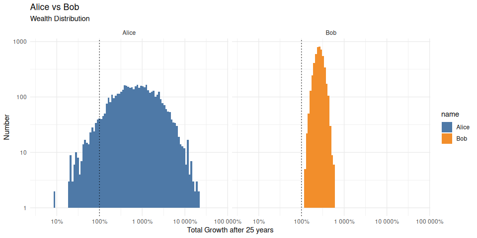

# Test

    # A tibble: 2 × 3
      name   mean     sd
      <chr> <dbl>  <dbl>
    1 Alice  1.11 0.250 
    2 Bob    1.04 0.0499

    # A tibble: 3 × 4
    # Groups:   name [2]
      name  ruined     n ratio
      <chr> <lgl>  <int> <dbl>
    1 Alice FALSE   4710 0.942
    2 Alice TRUE     290 0.058
    3 Bob   FALSE   5000 1    
