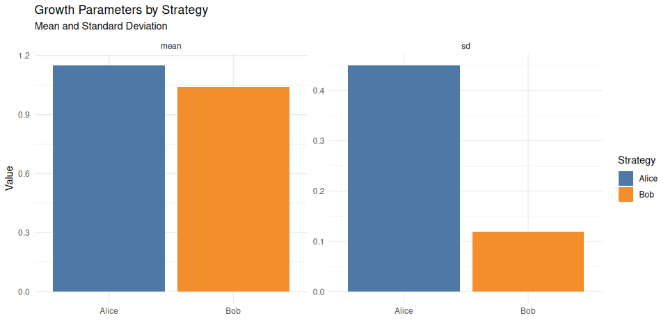

# Risk Strategies Simulation

Interactive visualizations exploring risk management strategies and
their long-term implications, inspired by [Luca Dellanna’s
work](https://luca-dellanna.com/posts/long-term-risks) on risk
management and long-term decision-making.

## Overview

This project provides visual simulations that demonstrate key concepts
from risk management research, including ergodicity, survival
strategies, and the importance of avoiding catastrophic losses in
long-term investment approaches.

## Visualizations

The project includes interactive simulations that demonstrate:

1.  **Monte Carlo Risk Simulations**: Comparing different risk
    strategies over thousands of scenarios
2.  **Long-term Performance Analysis**: Time series showing how
    different strategies perform over extended periods
3.  **Risk-Return Trade-offs**: Interactive exploration of the
    relationship between risk tolerance and long-term outcomes

#### Interested in Dev, AI, Modeling, Uncertainty, Decision Support Tools, or Sports Analytics?

This demo was created by Jens Laufer from [Solytics
GmbH](https://www.solytics.de) — a team passionate about empowering
better decisions under uncertainty.

We specialize in:

- Custom analytics and simulation tools  
- Forecasting, risk modeling, and decision intelligence  
- Data-driven product development  
- Sport Data Analytics
- Fullstack Softwaredevelopment

👉 [Visit solytics.de](https://www.solytics.de) — we’d love to hear from
you.
